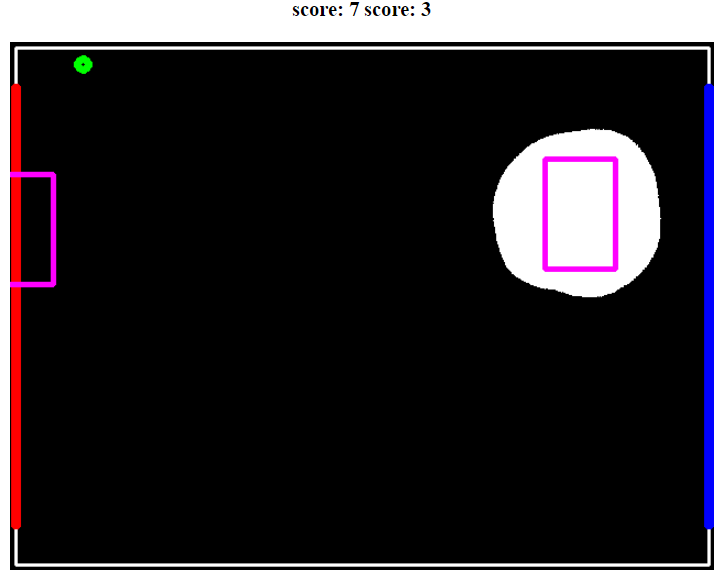
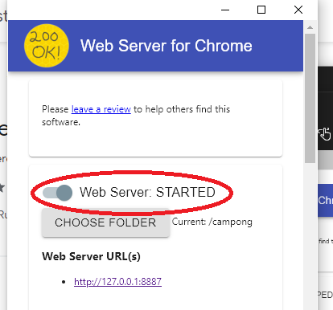
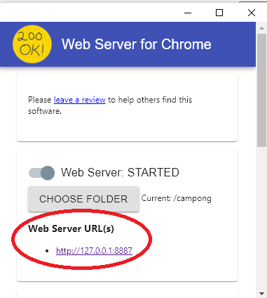
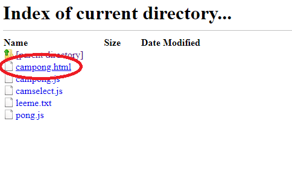
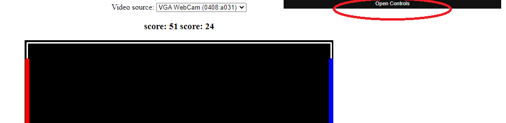
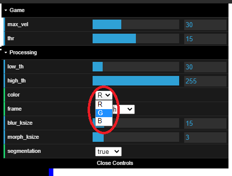
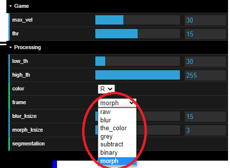
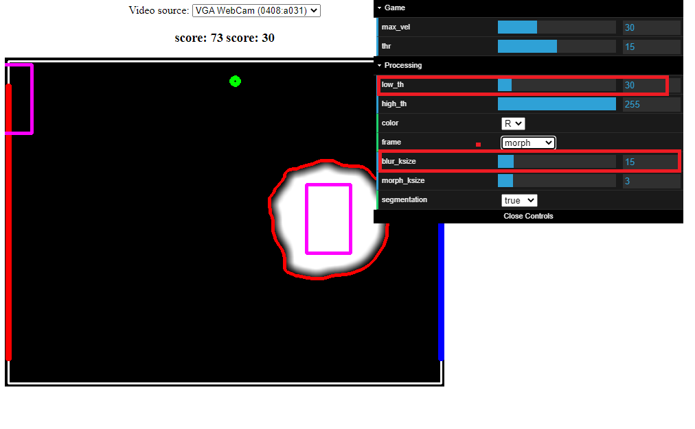

# Campong

Juego de ping pong usando opencvjs

[video explicativo](https://youtu.be/0RKpVqaxXiw)

## Para correr online

[Dar click aquí!](https://yjmantilla.github.io/juego-pdi/campong.html)

## Para correr localmente

### 1 Instalar web server for chrome :

https://chrome.google.com/webstore/detail/web-server-for-chrome/ofhbbkphhbklhfoeikjpcbhemlocgigb

### 2 Seleccionar la carpeta que contiene el archivo campong.html

### 3 Inicializar el servidor

### 4 Viajar a la dirección que indica la ventana

### 5 Abrir el archivo campong.html

## Configuración del reconocimiento

### 1 Abrir el panel de control

### 2 Escoger un objeto rojo, verde, o azul

Idealmente el color menos común en tu ambiente.

### 3 Ir a el fondo de "morph"

En este se puede ver facílmente si el reconocimiento está funcionando.

### 4 Configurar el procesamiento para facilitar el reconocimiento

Lo que mejor resulta configurar es:

- El límite inferior del umbral "low_th"
- El tamaño del kernel para el suavizado "blur_ksize"

